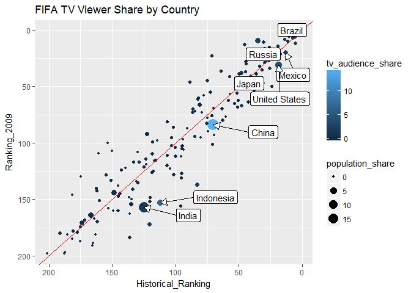

Tidy Tuesday: Fifa Audience
================
Ellis Hughes

First Look
----------

The data provided for this [\#TidyTuesday](https://github.com/rfordatascience/tidytuesday) is provided via [FiveThirtyEight.com](https://fivethirtyeight.com/features/how-to-break-fifa/).

``` r
str(fifa_audience)
```

    ## Classes 'tbl_df', 'tbl' and 'data.frame':    191 obs. of  6 variables:
    ##  $ X1                : int  1 2 3 4 5 6 7 8 9 10 ...
    ##  $ country           : chr  "United States" "Japan" "China" "Germany" ...
    ##  $ confederation     : chr  "CONCACAF" "AFC" "AFC" "UEFA" ...
    ##  $ population_share  : num  4.5 1.9 19.5 1.2 2.8 0.9 0.9 0.9 2.1 0.7 ...
    ##  $ tv_audience_share : num  4.3 4.9 14.8 2.9 7.1 2.1 2.1 2 3.1 1.8 ...
    ##  $ gdp_weighted_share: num  11.3 9.1 7.3 6.3 5.4 4.2 4 4 3.5 3.1 ...
    ##  - attr(*, "spec")=List of 2
    ##   ..$ cols   :List of 6
    ##   .. ..$ X1                : list()
    ##   .. .. ..- attr(*, "class")= chr  "collector_integer" "collector"
    ##   .. ..$ country           : list()
    ##   .. .. ..- attr(*, "class")= chr  "collector_character" "collector"
    ##   .. ..$ confederation     : list()
    ##   .. .. ..- attr(*, "class")= chr  "collector_character" "collector"
    ##   .. ..$ population_share  : list()
    ##   .. .. ..- attr(*, "class")= chr  "collector_double" "collector"
    ##   .. ..$ tv_audience_share : list()
    ##   .. .. ..- attr(*, "class")= chr  "collector_double" "collector"
    ##   .. ..$ gdp_weighted_share: list()
    ##   .. .. ..- attr(*, "class")= chr  "collector_double" "collector"
    ##   ..$ default: list()
    ##   .. ..- attr(*, "class")= chr  "collector_guess" "collector"
    ##   ..- attr(*, "class")= chr "col_spec"

It looks like this dataset is actually pretty small, with stats for 191 countries and 6 variables including country name.

Initial Thoughts
----------------

The data shows what percent of the total viewership that watched the 2010 FIFA world cup. My first thought is what would be a key indicator for viewership. That would likely be rankings of your countries teams for the past 5 years. I will extract that information directly from the FIFA website, as well as the historical average ranking. Not all the country names matched between the two datasets. I attempted to match best I could figure. I apologize for any mistakes.

``` r
library(rvest)
```

    ## Loading required package: xml2

    ## 
    ## Attaching package: 'rvest'

    ## The following object is masked from 'package:purrr':
    ## 
    ##     pluck

    ## The following object is masked from 'package:readr':
    ## 
    ##     guess_encoding

``` r
extractRankings<-function(url,country){
  
  urlhtml<-read_html(url)
  
  Rankings <- urlhtml%>%
    html_nodes(".col-xs-12")%>%
    html_nodes(".tbl-ranking")%>%
    html_table()%>%as.data.frame()%>%
    select(Rank,Date)
  
  Recent_Rankings<-Rankings%>%
    filter(Date<=2010, Date >= 2005)%>%
    {
      tmp<-rep(NA,6)
      names(tmp)<-paste0("Ranking_",2005:2010)
      if(nrow(.)>0){
        tmp[which(names(tmp)%in%paste0("Ranking_",.$Date))]<-.$Rank
      }
      return(tmp)
      }%>%
    as.data.frame%>%t
  
  Historical_Ranking<-Rankings%>%
    filter(Date<=2010)%>%
    data.frame%>%
    `$`("Rank")%>%
    as.numeric%>%
    mean(na.rm = TRUE)
  
  data.frame(Country=country,Recent_Rankings,Historical_Ranking=Historical_Ranking)
}

available_countries<-read_html("https://www.fifa.com/fifa-world-ranking/associations/")%>%
  html_nodes(".ranking-teamlist") %>%
  html_nodes("a") %>%
  {data.frame(Country=html_text(.),link=html_attr(.,"href"), stringsAsFactors = FALSE)}%>%
  mutate(url=paste0("https://www.fifa.com",link))%>%
  select(Country,url)%>%
  mutate(Country=dplyr::recode(Country,
                               USA="United States",
                               England="United Kingdom",
                               "China PR"="China",
                               "Korea Republic"="South Korea"
                               ))

available_countries%>%
  filter(Country %in% fifa_audience$country)%>%dim
```

    ## [1] 167   2

``` r
rankings<-available_countries%>%
  filter(Country %in% fifa_audience$country)%>%
  split(., seq(nrow(.)))%>%
  map_df(function(.x){
    rankings<-try(extractRankings(.x$url,.x$Country))
    if(inherits(rankings,"try-error")){
      data.frame(Country=.x$Country,NA,NA,NA,NA,NA,NA,NA)
    }else{
      rankings
    }})%>%
  rename(country=Country)

str(rankings)
```

    ## 'data.frame':    167 obs. of  8 variables:
    ##  $ country           : chr  "Afghanistan" "Albania" "Algeria" "American Samoa" ...
    ##  $ Ranking_2005      : int  195 65 35 203 88 5 60 199 26 46 ...
    ##  $ Ranking_2006      : int  193 96 26 203 95 8 100 198 21 61 ...
    ##  $ Ranking_2007      : int  183 81 64 201 70 6 113 193 28 92 ...
    ##  $ Ranking_2008      : int  191 80 79 201 73 1 93 201 48 94 ...
    ##  $ Ranking_2009      : int  180 87 80 198 55 3 123 198 39 65 ...
    ##  $ Ranking_2010      : int  189 82 80 205 61 4 108 200 48 69 ...
    ##  $ Historical_Ranking: num  190.9 90.6 62.7 201.1 72.3 ...

Not every country was included in the FIFA rankings for every country, so we are left with 167. Doing a quick linear regression between the years will give us an indicator which ranking is most significant for predicting viewership.

    ## Loading required package: carData

    ## 
    ## Attaching package: 'car'

    ## The following object is masked from 'package:dplyr':
    ## 
    ##     recode

    ## The following object is masked from 'package:purrr':
    ## 
    ##     some

    ## Anova Table (Type III tests)
    ## 
    ## Response: tv_audience_share
    ##                    Sum Sq  Df F value    Pr(>F)    
    ## (Intercept)         76.97   1 35.5776 1.584e-08 ***
    ## Historical_Ranking  11.21   1  5.1838   0.02416 *  
    ## Ranking_2010         0.40   1  0.1843   0.66831    
    ## Ranking_2009         5.80   1  2.6802   0.10362    
    ## Ranking_2008         2.60   1  1.2001   0.27500    
    ## Ranking_2007         5.62   1  2.5965   0.10912    
    ## Ranking_2006         0.00   1  0.0022   0.96237    
    ## Ranking_2005         0.02   1  0.0106   0.91812    
    ## Residuals          337.49 156                      
    ## ---
    ## Signif. codes:  0 '***' 0.001 '**' 0.01 '*' 0.05 '.' 0.1 ' ' 1

Surprisingly, it looks like the previous year, and historical ranking are the most significant for predicting viewership for the world cup! 2009 rankings were the next most significant (but not very significant), and I found that 2009 rankings were used for the seeding of the world cup after some investigation online (wikipedia) and clicking on a link to [FIFA.com](https://web.archive.org/web/20111225043322/http://www.fifa.com/worldcup/archive/southafrica2010/finaldraw/news/newsid%3D1142262/). Considering that the world cup takes place partway though the 2010 year (June-July), the 2009 rankings could provide some insight.

Visualization
-------------

I thought the most interesting way to show viewership would be comparing historical vs 2009 ranking, and setting the size of the points based on the population, and color by viewership share

``` r
library(ggrepel)


FIFA_PLOT<-ggplot(FIFA)+
  geom_point(aes(x=Historical_Ranking,y=Ranking_2009,color=tv_audience_share,size=population_share))+
  geom_abline(slope=1, intercept=0, color="red")+
  scale_x_reverse()+scale_y_reverse()+
  geom_label_repel(aes(label=country,x=Historical_Ranking,y=Ranking_2009),
                   data=FIFA[which(FIFA$tv_audience_share>3 | FIFA$population_share>5),],
                   arrow = arrow(length = unit(0.03, "npc"), type = "closed", ends = "last"),
                   force = 100,
                   nudge_x = 40)+
  ggtitle("FIFA TV Viewer Share by Country")


FIFA_PLOT
```

    ## Warning: Removed 1 rows containing missing values (geom_point).



Interestingly, most of the countries with the large populations and viewership underperformed in the 2009 year versus their historical success.

    ## Warning: Removed 1 rows containing missing values (geom_point).

    ## png 
    ##   2
