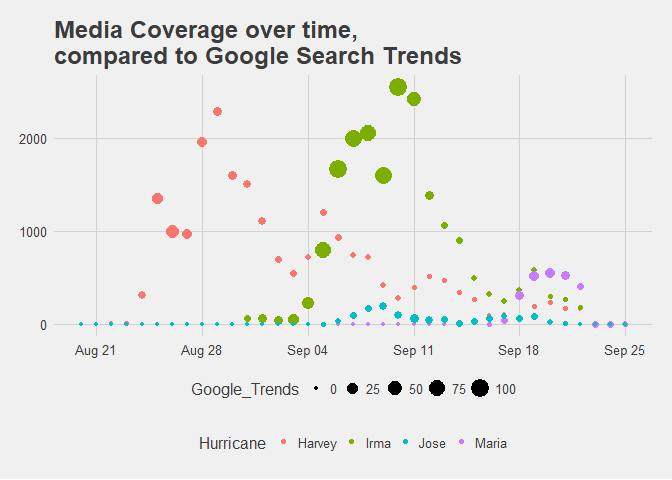

## Media Coverage by Hurricane and State
The data provided for this [#TidyTuesday](https://github.com/rfordatascience/tidytuesday) is provided via [FiveThirtyEight.com](https://fivethirtyeight.com/features/how-to-break-fifa/). It is a look at media coverage of the three major hurricanes of 2017. This was somewhat significant to me because I was on my honeymoon during this time period, and was in Barbados while some of this was occuring. Some of my new family was unable to make it to the wedding due to the hurricanes.

This specific datasets I am looking at is the Media Coverage of the hurricanes and the google search trends of the Hurricanes names. "Media Coverage" was calculated based off of the number of sentences mentiontion either the state or hurricane among the outlets in Media Cloud's "U.S. Top Online News" collection. I merged the two datasets together and was left with a dataset that covered August 20th to September 25th, 2017.


```r
coverage<-merge(Hurricane_Coverage_Online,Hurricane_Google_Trends,by="Date")

head(coverage)
```

```
##         Date Harvey Irma Maria Jose "Hurricane Harvey": (United States)
## 1 2017-08-20      0    0     0    0                                   0
## 2 2017-08-21      0    0     0    0                                   0
## 3 2017-08-22      4    1     0    0                                   0
## 4 2017-08-23      6    1     0    0                                   1
## 5 2017-08-24    309    0     0    0                                   9
## 6 2017-08-25   1348    1     0    0                                  29
##   "Hurricane Irma": (United States) "Hurricane Maria": (United States)
## 1                                 0                                  0
## 2                                 0                                  0
## 3                                 0                                  0
## 4                                 0                                  0
## 5                                 0                                  0
## 6                                 0                                  0
##   "Hurricane Jose": (United States)
## 1                                 0
## 2                                 0
## 3                                 0
## 4                                 0
## 5                                 0
## 6                                 0
```


## Google vs The Internet 

The reason I decided on these two data sets is that realistically google is the front door to the internet. When querying on the internet to learn more, google is usually the tool one would use. At the same time, I would surmise that querying leads to a higher probability of coverage due to the fact that internet news gets its revenue from page clicks. 

Unsurprisingly, the google trend highlights that the more the term is searched for, the more it is written about. Or vice versa.

However, one interesting thing I am seeing is a weekly cyclical pattern to the coverage of Hurricane Harvey. Perhaps something to look into at another time.

<!-- -->


```
## png 
##   2
```
