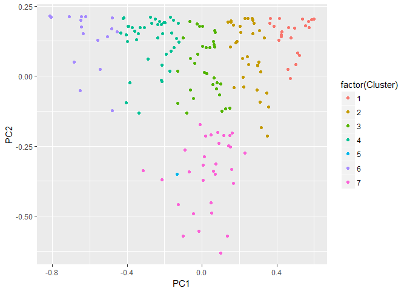
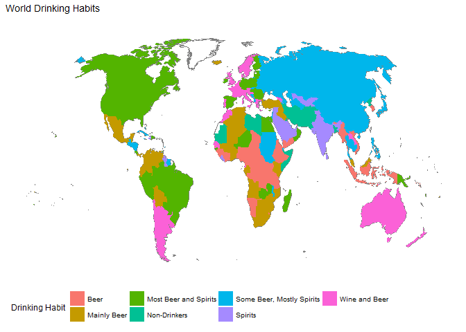

This weeks [#TidyTuesday](https://github.com/rfordatascience/tidytuesday) is once again provided by [FiveThirtyEight.com](https://fivethirtyeight.com/). This time it is a topic I think most of us can relate to, [alcohol consumption](https://fivethirtyeight.com/features/dear-mona-followup-where-do-people-drink-the-most-beer-wine-and-spirits/). 

FiveThirtyEight kindly took the WHO data on beverage consumption and broke it down into number of servings per captita of Beer, Wine and Spirits. They did some fun stuff with the data, but I was curous which countries are the most similar in the choices of alcohol consumption.


```r
library(tidyverse)
```

```
## -- Attaching packages ---------------------------------- tidyverse 1.2.1 --
```

```
## v ggplot2 2.2.1     v purrr   0.2.4
## v tibble  1.4.2     v dplyr   0.7.5
## v tidyr   0.8.1     v stringr 1.3.1
## v readr   1.1.1     v forcats 0.3.0
```

```
## -- Conflicts ------------------------------------- tidyverse_conflicts() --
## x dplyr::filter() masks stats::filter()
## x dplyr::lag()    masks stats::lag()
```

```r
library(httr)  
library(rgdal)
```

```
## Loading required package: sp
```

```
## rgdal: version: 1.3-3, (SVN revision 759)
##  Geospatial Data Abstraction Library extensions to R successfully loaded
##  Loaded GDAL runtime: GDAL 2.2.3, released 2017/11/20
##  Path to GDAL shared files: F:/Documents/R/win-library/3.5/rgdal/gdal
##  GDAL binary built with GEOS: TRUE 
##  Loaded PROJ.4 runtime: Rel. 4.9.3, 15 August 2016, [PJ_VERSION: 493]
##  Path to PROJ.4 shared files: F:/Documents/R/win-library/3.5/rgdal/proj
##  Linking to sp version: 1.3-1
```

```r
library(ggthemes)

alcohol<-read_csv("https://raw.githubusercontent.com/rfordatascience/tidytuesday/master/data/week13_alcohol_global.csv")
```

```
## Parsed with column specification:
## cols(
##   country = col_character(),
##   beer_servings = col_integer(),
##   spirit_servings = col_integer(),
##   wine_servings = col_integer(),
##   total_litres_of_pure_alcohol = col_double()
## )
```

```r
set.seed(9917)
```

I am more interested in what the world chooses to drink when they do, not what is the total volume. Then which countries were the most similar.

I normalized each beverage type by the total number of beverages, and then performed a PCA. After the PCA, I originally ran kmeans with 5 centers. In my mind there would be 5 groups of drinkers; Non-Drinkers, one of each of the three categories, and one equal oportunist drinker. As it turned out, as I increased the number of groups, more clear drinking patterns emerged. For example, several countries nearly exclusively drink Beer, another set exclusively drink spirits. here did not appear to be a solely wine drinking grouping.

After plotting the first two PC's, there were no obvious groupings when the points are not colored, but it did look like there were trends. They did get highlighted by the coloring.


```r
NormAlcohol<-alcohol%>%
  mutate(TotalServings=beer_servings+spirit_servings+wine_servings,
         beer=beer_servings/TotalServings,
         spirits=spirit_servings/TotalServings,
         wine=wine_servings/TotalServings
         )%>%
  select(country,beer,spirits,wine)%>%
  replace_na(list(beer=0,spirits=0,wine=0))%>%
  data.frame%>%
  `rownames<-`(.,.$country)

alcoholPRCOMP<-NormAlcohol%>%
  select(-country)%>%
  prcomp()

cluster<-alcoholPRCOMP$x%>%
  data.frame%>%
  mutate(Cluster=kmeans(.,centers=7)%>%'$'(cluster),
         country=rownames(.))


ggplot(cluster)+
  geom_point(aes(x = PC1, y=PC2, color=factor(Cluster)))
```

<!-- -->

When I took a look at the actual clusters average consumption, it was not exacly how I thought. There were the non-drinkers/equal-opportunity grouped together. Likely due to no specific direction in the PCs. Beer and Spirits both had clear groups. Then there were two groups, a beer and wine group, and a mainly beer but drinks spirits.


```r
summary_groups<-NormAlcohol%>%
  mutate(country=rownames(.))%>%
  merge(cluster[,c("Cluster","country")])%>%
  group_by(Cluster)%>%
  summarise(
    totalDrinks=sum(beer)+sum(wine)+sum(spirits),
    beer=sum(beer),
    wine=sum(wine),
    spirits=sum(spirits),
    countries=paste(country,collapse=", "))%>%
  mutate(beer=beer/totalDrinks,wine=wine/totalDrinks,spirits=spirits/totalDrinks)%>%
  select(-totalDrinks)

knitr::kable(summary_groups)
```


 Cluster        beer        wine     spirits  countries                                                                                                                                                                                                                                                                                                                                                                                                                                               
--------  ----------  ----------  ----------  --------------------------------------------------------------------------------------------------------------------------------------------------------------------------------------------------------------------------------------------------------------------------------------------------------------------------------------------------------------------------------------------------------------------------------------------------------
       1   0.8969704   0.0414254   0.0616042  Bhutan, Brunei, Burundi, Cameroon, Central African Republic, Chad, Congo, Cote d'Ivoire, DR Congo, Eritrea, Ethiopia, Gambia, Guinea, Indonesia, Myanmar, Namibia, Nauru, Nigeria, Rwanda, Sierra Leone, Solomon Islands, South Korea, Swaziland, Tanzania, Uganda, Vietnam, Yemen                                                                                                                                                                      
       2   0.6950308   0.1136270   0.1913422  Algeria, Angola, Belize, Benin, Bolivia, Botswana, Burkina Faso, Cabo Verde, Colombia, Ecuador, Fiji, Gabon, Ghana, Iceland, Iraq, Kenya, Lesotho, Malaysia, Mali, Mauritius, Mexico, Mozambique, Palau, Panama, Samoa, Seychelles, Singapore, South Africa, Togo, Tunisia, Turkey, Venezuela, Zimbabwe                                                                                                                                                 
       3   0.5123286   0.1470226   0.3406487  Brazil, Bulgaria, Canada, Costa Rica, Cyprus, Czech Republic, Dominican Republic, Egypt, Estonia, Finland, Germany, Guinea-Bissau, Hungary, Ireland, Latvia, Lithuania, Madagascar, Micronesia, Niger, Oman, Papua New Guinea, Paraguay, Peru, Poland, Romania, Serbia, Spain, Tonga, Trinidad & Tobago, USA, Vanuatu, Zambia                                                                                                                           
       4   0.3470504   0.0705393   0.5824103  Albania, Antigua & Barbuda, Azerbaijan, Bahamas, Bahrain, Barbados, Belarus, Bosnia-Herzegovina, Cambodia, China, Comoros, Cuba, Djibouti, El Salvador, Grenada, Guatemala, Honduras, Israel, Jamaica, Japan, Kazakhstan, Kiribati, Lebanon, Malawi, Moldova, Mongolia, Nepal, Nicaragua, Niue, Philippines, Russian Federation, Slovakia, St. Kitts & Nevis, St. Lucia, St. Vincent & the Grenadines, Sudan, Suriname, Thailand, Turkmenistan, Ukraine 
       5         NaN         NaN         NaN  Afghanistan, Bangladesh, Iran, Kuwait, Libya, Maldives, Marshall Islands, Mauritania, Monaco, North Korea, Pakistan, San Marino, Somalia                                                                                                                                                                                                                                                                                                                
       6   0.1097322   0.0661751   0.8240927  Armenia, Cook Islands, Dominica, Guyana, Haiti, India, Jordan, Kyrgyzstan, Liberia, Qatar, Saudi Arabia, Sri Lanka, Syria, Tajikistan, Tuvalu, United Arab Emirates, Uzbekistan                                                                                                                                                                                                                                                                         
       7   0.3611004   0.4718502   0.1670495  Andorra, Argentina, Australia, Austria, Belgium, Chile, Croatia, Denmark, Equatorial Guinea, France, Georgia, Greece, Italy, Laos, Luxembourg, Macedonia, Malta, Montenegro, Morocco, Netherlands, New Zealand, Norway, Portugal, Sao Tome & Principe, Senegal, Slovenia, Sweden, Switzerland, Timor-Leste, United Kingdom, Uruguay                                                                                                                     

I am now going to visualize these groups on a choropleth chart. I must admit that I don't have experience plotting on choropleths. To do this, I somewhat blindly followed the instructions from [this site](https://rud.is/b/2015/07/09/faceted-world-population-by-income-choropleths-in-ggplot/).


```r
# this ensures you only download the shapefile once and hides
# errors and warnings. remove `try` and `invisible` to see messages
try(invisible(GET("http://www.pewglobal.org/wp-content/lib/js/world-geo.json",write_disk("world-geo.json"))), silent=TRUE)

world <- readOGR("world-geo.json")
```

```
## OGR data source with driver: GeoJSON 
## Source: "F:\Documents\TidyTuesday\The Worlds Drinks\world-geo.json", layer: "world-geo"
## with 243 features
## It has 2 fields
```

```r
world_wt <- spTransform(world, CRS("+proj=robin"))
world_map <- fortify(world_wt)%>%
  left_join(data_frame(id=rownames(world@data), name=world@data$name)) %>%
  select(-id)%>%
  rename(id=name) %>%
  mutate(id=recode(id,
                        "Republic of the Congo"="Congo",
                        "Ivory Coast"="Cote d'Ivoire",
                        "Democratic Republic of the Congo"="DR Congo",
                        "Burma (Myanmar)"="Myanmar",
                        "Cape Verde"="Cabo Verde",
                        "United States"="USA",
                        "Antigua and Barbuda"="Antigua & Barbuda",
                        "Guinea Bissau"="Guinea-Bissau" ,
                        "Russia"="Russian Federation",
                        "St. Kitts and Nevis"="St. Kitts & Nevis",
                        "St. Vincent and the Grenadines"="St. Vincent & the Grenadines",
                        "Trinidad and Tobago"="Trinidad & Tobago",
                        "Bosnia and Herzegovina"="Bosnia-Herzegovina",
                        "Kyrgyz Republic"="Kyrgyzstan",
                        "Republic of Macedonia"="Macedonia",
                        "Sao Tome and Principe"="Sao Tome & Principe"
  ))
```

```
## Regions defined for each Polygons
```

```
## Joining, by = "id"
```

```r
GroupedCountries<-summary_groups%>%
  mutate(DrinkerType=c("Beer","Mainly Beer","Most Beer and Spirits","Some Beer, Mostly Spirits","Non-Drinkers","Spirits","Wine and Beer"))%>%
  separate_rows(countries,sep = ", ")%>%
  rename(country=countries)%>%
  merge(alcohol,by="country")%>%
  mutate(hover=paste("Country:",country,"<br>Group:",DrinkerType,
                     "<br>Beer:",beer_servings,"<br>Sprits:",spirit_servings,"<br>Wine:",wine_servings))%>%
  merge(world_map,
        
        by.x="country",by.y="id")

gg<-ggplot() +
  geom_map(data=world_map, map=world_map,
                    aes(x=long, y=lat, map_id=id),
                    color="#7f7f7f", fill="white", size=0.15)+
  geom_map(data=GroupedCountries,
           map=world_map,
           aes(map_id = country, x=long, y=lat, fill=DrinkerType,text=hover))+
  theme_map()+
  theme(legend.position="bottom")+
  guides(fill=guide_legend(title="Drinking Habit"))+
  labs(title="World Drinking Habits\n")
```

```
## Warning: Ignoring unknown aesthetics: x, y
```

```
## Warning: Ignoring unknown aesthetics: x, y, text
```

```r
ggsave(gg,filename = "World_Drinking_habits.PNG",height = 7,width = 10)
 
gg
```

<!-- -->

