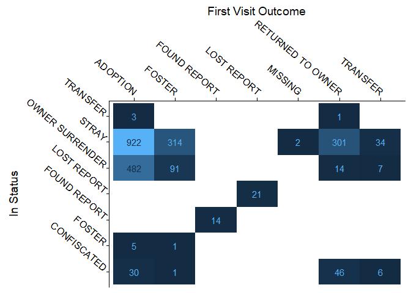
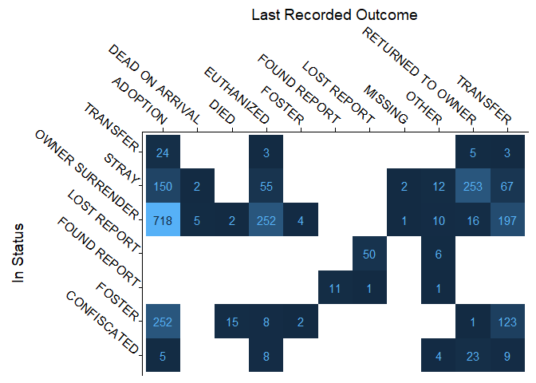
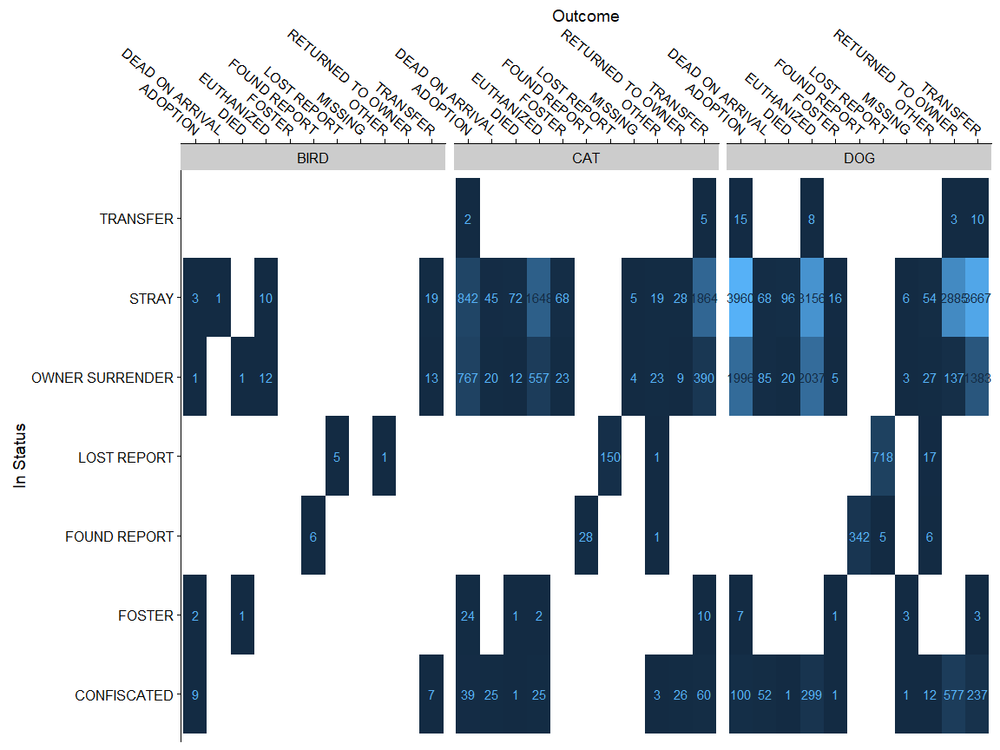

## Woof
I am a dog person. How can you not love how excited your dog gets when you walk in after a quick, I-was-not-even-gone-5-minutes run to get the newspaper or errands. This weeks [#TidyTuesday](https://github.com/rfordatascience/tidytuesday) on the Dallas animal shelter got me excited to see the trends in adoption. 

The dataset was provided in an excel file from [Dallas Open Data](https://www.dallasopendata.com/City-Services/FY-2017-Dallas-Animal-Shelter-Data/sjyj-ydcj).


```r
str(Dallas_Shelter)
```

```
## 'data.frame':	34819 obs. of  13 variables:
##  $ animal_id       : chr  "A0979593" "A0743013" "A1004433" "A0969724" ...
##  $ animal_type     : chr  "DOG" "DOG" "BIRD" "DOG" ...
##  $ animal_breed    : chr  "RHOD RIDGEBACK" "YORKSHIRE TERR" "CHICKEN" "GERM SHEPHERD" ...
##  $ month           : chr  "FEB" "NOV" "AUG" "DEC" ...
##  $ year            : num  2017 2016 2017 2016 2017 ...
##  $ census_tract    : chr  "1502" "13609" "10803" "7102" ...
##  $ council_district: chr  "2" "11" "3" "2" ...
##  $ intake_type     : chr  "CONFISCATED" "STRAY" "STRAY" "STRAY" ...
##  $ intake_date     : num  42786 42693 42954 42719 42782 ...
##  $ outcome_type    : chr  "DEAD ON ARRIVAL" "RETURNED TO OWNER" "TRANSFER" "ADOPTION" ...
##  $ outcome_date    : num  42787 42693 42955 42724 42785 ...
##  $ chip_status     : chr  "SCAN NO CHIP" "SCAN CHIP" "SCAN NO CHIP" "SCAN NO CHIP" ...
##  $ animal_origin   : chr  "FIELD" "FIELD" "FIELD" "FIELD" ...
```

#Recidivism
One curiosity I had was whether there were any animals that tended to return to the shelter, and why. There were 2295 animals that had multiple(>1) run ins with the Dallas Shelter. 1851 of these multiple returners were dogs, 1 was categorized as 'wildlife', and the remaining were cats. The majority of these animals started as stray(1573) animals or were surrendered by their owners(594).

Happily 1442 were found homes, returned to their owner, or put into a foster home. If the story had stopped there, like for the 11689 other animals, this would be a happy story. However, if you look at the last recorded visit for these animals, most were returned or surrendered by their owners, and the number of bleak outcomes is much higher. 


```r
MultipleVisits<-Dallas_Shelter%>%
  group_by(animal_id)%>%
  filter(n()>1)%>%
  ungroup()

singleVisit<-Dallas_Shelter%>%
  group_by(animal_id)%>%
  filter(n()==1)%>%
  ungroup()

Recidivism_first<-MultipleVisits%>%
  group_by(animal_id)%>%
  filter(intake_date==min(intake_date))%>%
  filter(row_number()==1 )%>%
  filter(!(outcome_type%in%c('EUTHANIZED','DEAD ON ARRIVAL')))%>% # Some issues with multiple rows for the same animal
  ungroup()

SummarizeRecidivism_first<-Recidivism_first%>%
  group_by(intake_type,outcome_type)%>%
  summarise(count=n())%>%
  ungroup()%>%
  mutate(outcome_type=as.factor(outcome_type))

SummarizeRecidivism_last<-MultipleVisits%>%
  group_by(animal_id)%>%
  filter(intake_date==max(intake_date))%>%
  filter(row_number()==1 )%>%
  ungroup()%>%
  group_by(intake_type,outcome_type)%>%
  summarise(count=n())%>%
  ungroup()%>%
  mutate(outcome_type=as.factor(outcome_type))

intake_typeLevels<-unique(c(SummarizeRecidivism_first$intake_type,SummarizeRecidivism_last$intake_type))
```


```r
first_record<-ggplot(SummarizeRecidivism_first,
                    aes(x=outcome_type,y=factor(intake_type,levels=intake_typeLevels)))+
  geom_tile(aes(fill=count),show.legend = FALSE)+
  geom_text(aes(label=count,color=ifelse(count>400,0,1)),show.legend = FALSE)+
  scale_x_discrete(position = "top")+
  theme(axis.text.x = element_text(angle = -40, hjust = 1))+
  theme(axis.text.y = element_text(angle = -40, hjust = 1, vjust = 0))+
  xlab("First Visit Outcome")+
  ylab("In Status")
print(first_record)
```

<!-- -->

```r
second_record<-ggplot(SummarizeRecidivism_last,
                   aes(x=outcome_type,y=factor(intake_type,levels=intake_typeLevels)))+
  geom_tile(aes(fill=count),show.legend = FALSE)+
  geom_text(aes(label=count,color=ifelse(count>400,0,1)),show.legend = FALSE)+
  scale_x_discrete(position = "top")+
  theme(axis.text.x = element_text(angle = -40, hjust = 1))+
  theme(axis.text.y = element_text(angle = -40, hjust = 1, vjust = 0))+
  xlab('Last Recorded Outcome')+
  ylab("In Status")
print(second_record)
```

<!-- -->

#Single Visits

For the Animals that only have a single visit, thankfully a large number to get adopted. However, when you look at the heatmap, there are three cells that are large. All three have the input type being a stray, and nearly for every stray that is adopted, one is euthanized and another transfered to another shelter.


```r
SummarizeSingleVisit<-singleVisit%>%
  filter(intake_type!="WILDLIFE")%>%
  filter(!animal_type%in%c("LIVESTOCK","WILDLIFE"))%>%
  group_by(animal_id)%>%
  filter(intake_date==max(intake_date))%>%
  filter(row_number()==1 )%>%
  ungroup()%>%
  group_by(intake_type,outcome_type,animal_type)%>%
  summarise(count=n())%>%
  ungroup()%>%
  mutate(outcome_type=as.factor(outcome_type))

single_visit<-ggplot(SummarizeSingleVisit,
                   aes(x=outcome_type,y=factor(intake_type,levels=intake_typeLevels)))+
  geom_tile(aes(fill=count),show.legend = FALSE)+
  geom_text(aes(label=count,color=ifelse(count>1000,0,1)),show.legend = FALSE)+
  scale_x_discrete(position = "top")+
  theme(axis.text.x = element_text(angle = -40, hjust = 1))+
  xlab('Outcome')+
  ylab("In Status")+
  facet_grid(.~animal_type)
print(single_visit)
```

<!-- -->


